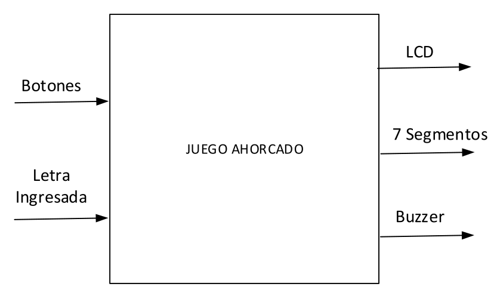
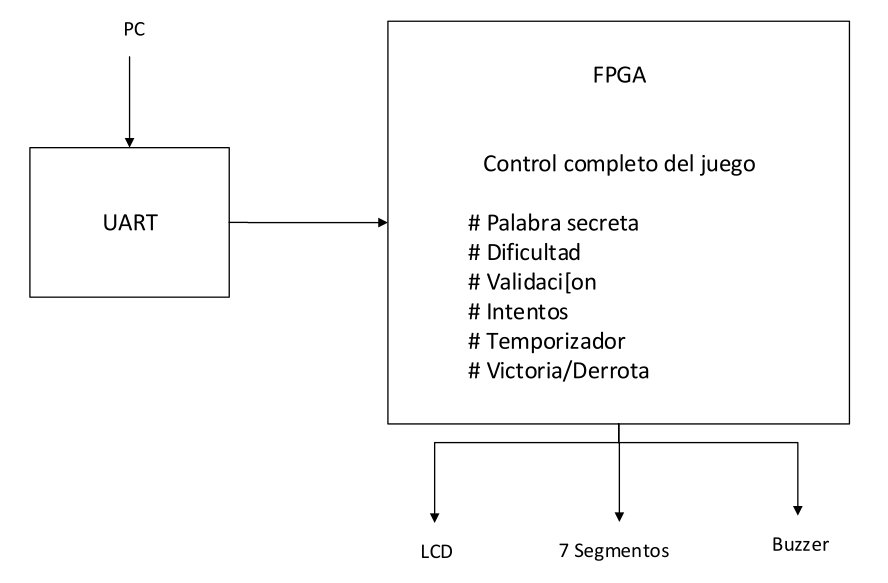
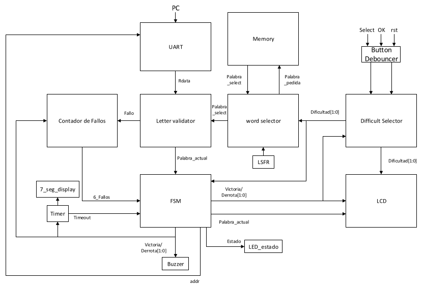
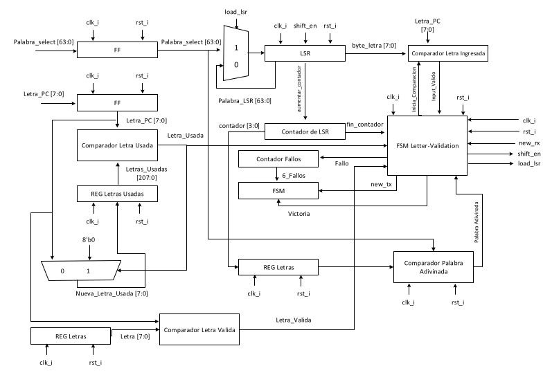
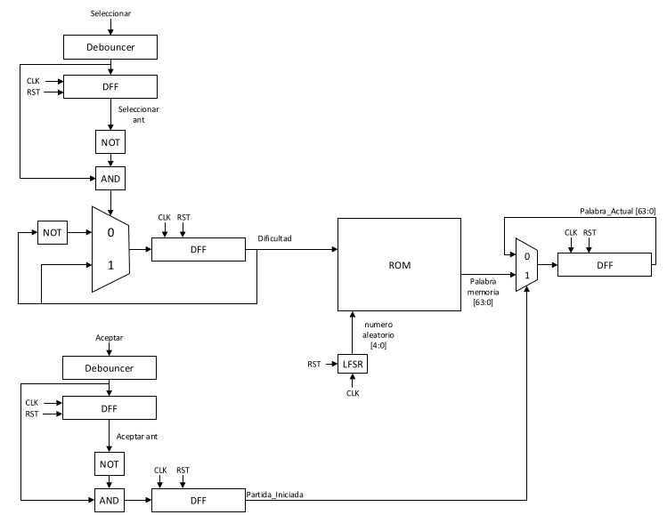
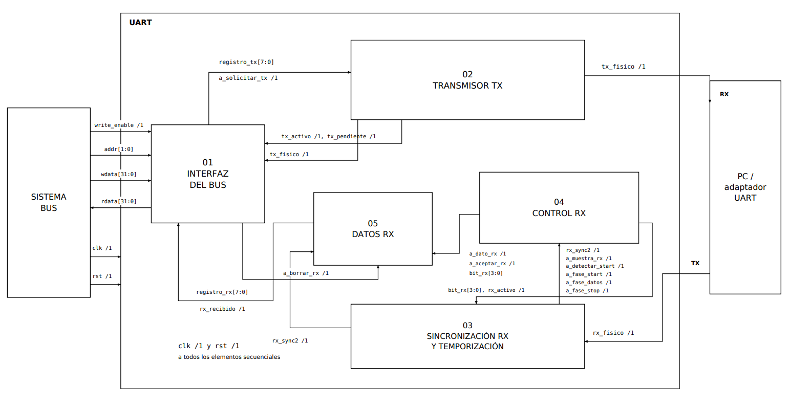

# Diseño de Juego Ahorcado (FPGA / periférico LCD)

## Primer Nivel: Descripción General del Sistema
En este primer nivel se muestra la funcionalidad básica del circuito, el juego de Ahorcado recibe las señales de las pulsaciones de 3 botones, uno para intercambiar la dificultad del juego cada vez que se pulse, otro para confirmar la selección de dificultad y el último como señal de reset general. También recibe entradas proporcionadas por el jugador como letras. El sistema tiene como salidas generales las señales que controlan el LCD, el Buzzer y los Displays 7 segmentos.

---

## Segundo Nivel: Arquitectura de Subsistemas
Para el segundo nivel se maneja la entrada introducida por el jugador desde el PC por medio un UART que realiza la comunicación entre la PC y la FPGA. Esta última es la que se encargará de manejar toda la lógica del juego, desde elegir aleatoriamente una palabra para adivinar, hasta manejar las letras introducidas, repetidas y fallidas, además de comunicar al LCD los datos que tiene que mostrar, y encender los Displays 7 segmentos del timer y el buzzer según el estado del juego.

---

## Tercer Nivel: 
Para el tercer nivel, se cuenta con un módulo antirebotes que recibe las entradas de las pulsaciones de los botones, los cuales son los encargados de seleccionar la dificultad, confirmar la selección y enviar una señal de reset general a la FSM. El módulo "Difficulty Selector" recibe la señal "Select" con la cual cambia el modo de juego de fácil a difícil o viceversa. Esta luego envía la señal "Dificultad" al LCD para que muestre cua está seleccionada.
La Memoria cuenta con bancos de memoria para las palabras según la difcultad e impresiones fijas que se realizan en la partida en el LCD. El módulo "Word Selector" junto al generador de números aleatorios se encargan de seleccionar una palabra al azar correspondiente a la memoria de cada dificultad, la cual se envía como la señal "Palabra_Select" hacia el módulo "Letter-Validation".
El módulo "Letter-Validation" tiene varias funciones, se encarga de recibir la letra ingresada en la PC por medio del UART, luego verifica si es una letra válida, donde n caso de que no lo sea no es ignorada, después checa si la letra ya ha sido utiliza, y por último la compara con cada letra de la palabra a adivinar, en caso de que la comparación devuelva 0 bits, aumenta el contador de fallos. Este contador puede incrementarse hasta 6, cuando esto ocurre levanta una bandera para que FSM finalice el juego. En caso de que todas las letras de la palabra fueran adivinadas, se levanta una bandera "Victoria" para que la FSM termine el juego y el mensaje de victoria en el LCD, esto último también ocurre si se pierde la partida.
El módulo Timer, cuenta con un contador el cual, según la dificultad seleccionada, tiene un tiempo determinado de ronda, 120 segundos para el modo fácil y 90 segundos para el modo difícil, en caso de que se acabe el tiempo envía una señal de "timeout" hacia la FSM.
LA FSM se encarga se enviar o recibir las señales de control según sea el estado de la partida. Además tanto el periférico UART como el LCD cuenta con un módulo de control aparte de la FSM.

---

## Cuarto Nivel

### Validador de letra
#### a) Diagrama / Diseño

#### b) Objetivo del módulo
Este módulo busca procesar y validar cada una de las letras ingresadas por el jugador a través de la PC, evalúa si la letra recibida es una letra válida (Letras mayúsculas únicamente) y comprueba mediante un registro de letras usadas si ya ha sido ingresada previamente, esto con el fin de evitar contar fallos por letras duplicadas. Luego, compara la letra ingresada con cada una de las posiciones de la palabra almacenada temporalmente en un registro. Si la letra es correcta, actualiza el estado visible de la palabra revelando las posiciones correspondientes; de lo contrario, incrementa el contador de fallos.

### Debouncer, Selector de Dificultad y Selector de palabra
#### a) Diagrama / Diseño

#### b) Objetivo del módulo

### Periférico LCD

#### a) Diagrama / Diseño 

#### b) Objetivo del módulo

Este módulo describe la comunicación de datos externos, como de las señales internas del periférico que logran mostrar un resultado según su entrada, las cuales viene de la UART y la FSM general.
En el diagrama se observa una FSM_LCD, la encargada de organizar y secuenciar todas las señales internas sin ver ni un solo dato de información. Existen dos registros principales, REG 0, encargado principalmente de las señales de control y manejo de la palabra y también REG 1, siendo este el registro de los datos de la palabra. Para este caso La FSM toma en cuenta las señales de control de ROG 0 para saber hacia donde ir y llevar la información, ya que son estados, el LCD toma un tiempo mientras lee, registra, escribe y acaba con la información por lo que no puede enviar señales sin control.
Siguiendo el razonamiento de los bloques de registro REG 0 y REG 1, es importante tener un timer dentro del sistema ya que toma en cuenta el cambio de frecuencia entre la FPGA y el funcionamiento del módulo. Este bloque controla los tiempos de "start" con "hold" y "busy" mientras lee y escribe la letra hasta un "done", finalizando el uso del LCD.
Para la salida final del bloque del LCD, existe un sub-bloque LCD screen,que se encarga de selecionar el espacio de la letra "adivinada" de la mano de la FSM que le comunica, la selección del registro(espacio en el que va a escribir), escribir en el registro y una señal de habilitar el LCD para visualizar la letra escogida

###  UART

#### a) Diagrama modular / Diseño

#### b) Objetivo del módulo

El objetivo del módulo UART es establecer una comunicación serial asíncrona y bidireccional entre el sistema de bus y un dispositivo externo, como una computadora. Su interfaz permite escribir los datos que se desean transmitir, leer la información recibida y consultar el estado de la comunicación mediante registros seleccionados por una dirección.

Para la transmisión, convierte los datos paralelos en una secuencia serial, incorporando los bits de inicio y parada. Durante la recepción, sincroniza la señal de entrada con el reloj interno, detecta el inicio de una trama y toma muestras de los bits para reconstruir el dato y almacenarlo hasta su lectura.

Además, controla los tiempos de transmisión y recepción según la velocidad configurada y genera indicadores de transmisión activa, transmisión pendiente y dato recibido. De esta manera, integra el intercambio de información serial con las operaciones de lectura y escritura del bus.

