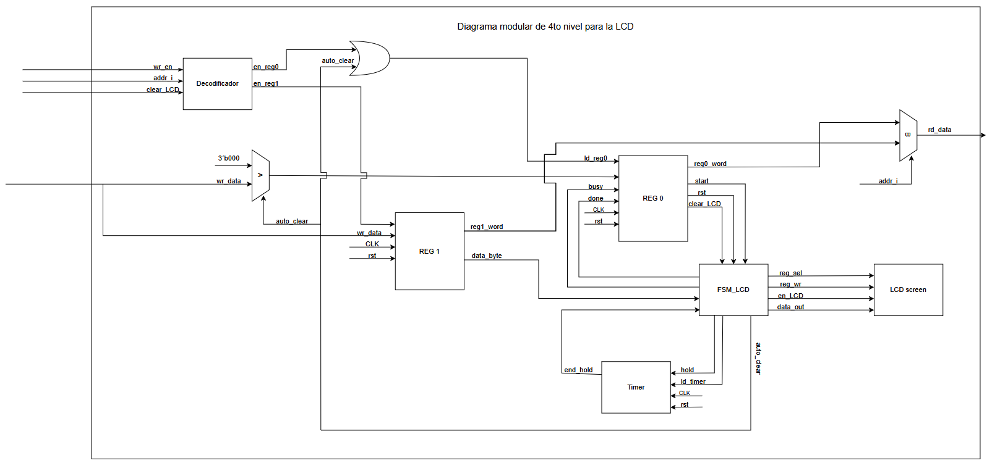

# Diseño de Juego Ahorcado (FPGA / periférico LCD)

## Primer Nivel: Descripción General del Sistema

---

## Segundo Nivel: Arquitectura de Subsistemas

## Tercer Nivel: 

## Cuarto Nivel

### Validador de letra

### Selector de palabra

### Periférido LCD

#### a) Diagrama / Diseño 

#### b) Objetivo del módulo

Este módulo describe la comunicación de datos externos, como de las señales internas del periférico que logran mostrar un resultado según su entrada, las cuales viene de la UART y la FSM general.
En el diagrama se observa una FSM_LCD, la encargada de organizar y secuenciar todas las señales internas sin ver ni un solo dato de información. Existen dos registros principales, REG 0, encargado principalmente de las señales de control y manejo de la palabra y también REG 1, siendo este el registro de los datos de la palabra. Para este caso La FSM toma en cuenta las señales de control de ROG 0 para saber hacia donde ir y llevar la información, ya que son estados, el LCD toma un tiempo mientras lee, registra, escribe y acaba con la información por lo que no puede enviar señales sin control.
Siguiendo el razonamiento de los bloques de registro REG 0 y REG 1, es importante tener un timer dentro del sistema ya que toma en cuenta el cambio de frecuencia entre la FPGA y el funcionamiento del módulo. Este bloque controla los tiempos de "start" con "hold" y "busy" mientras lee y escribe la letra hasta un "done", finalizando el uso del LCD.
Para la salida final del bloque del LCD, existe un sub-bloque LCD screen,que se encarga de selecionar el espacio de la letra "adivinada" de la mano de la FSM que le comunica, la selección del registro(espacio en el que va a escribir), escribir en el registro y una señal de habilitar el LCD para visualizar la letra escogida

### Máquina de estado

### Indicador de posición mediante LEDs

#### a) Diagrama modular / Diseño 