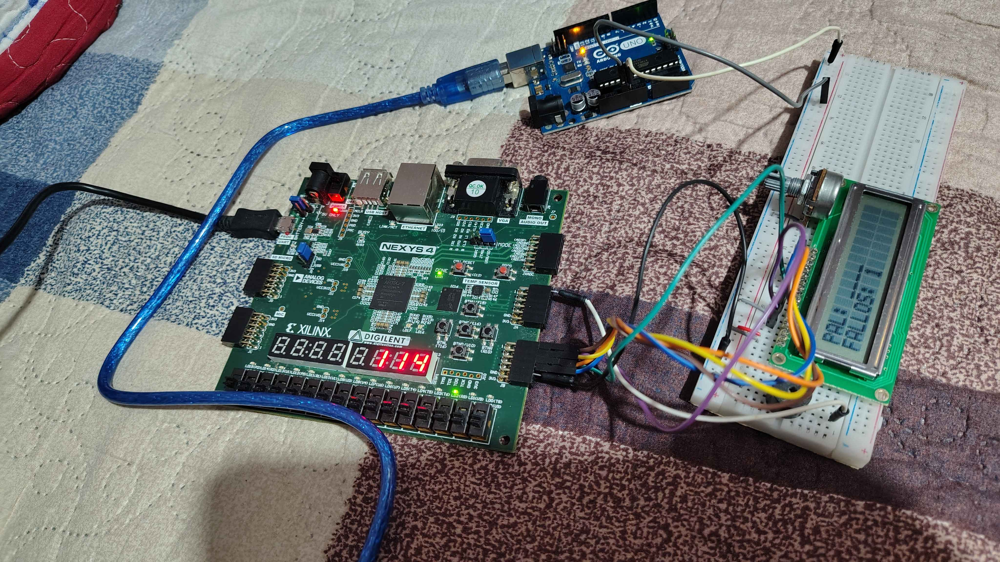
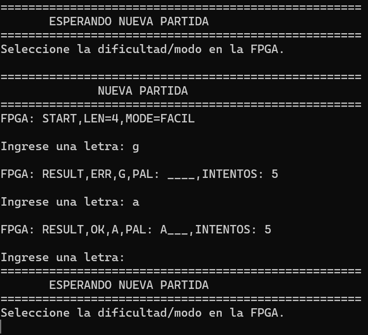
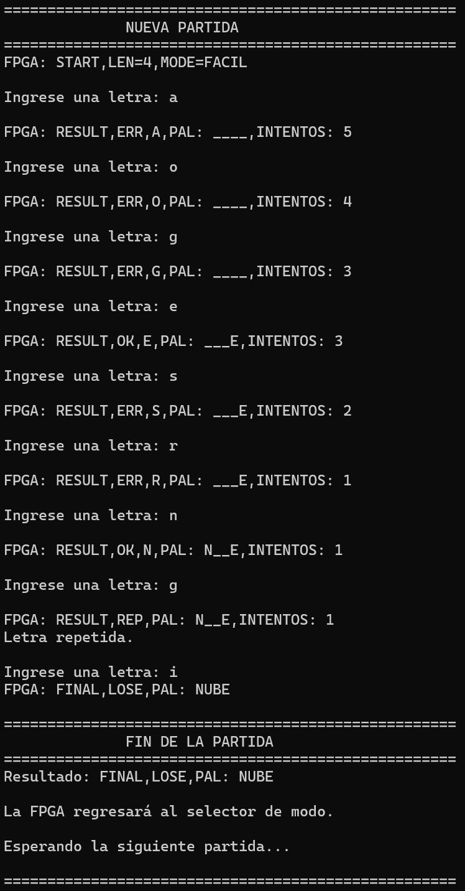
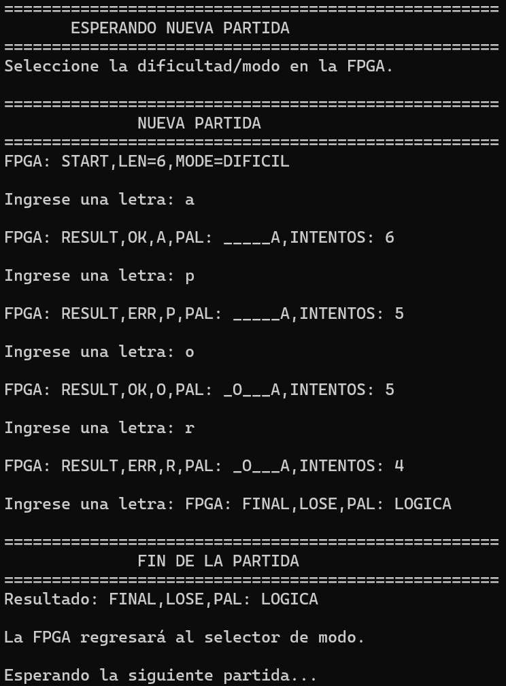
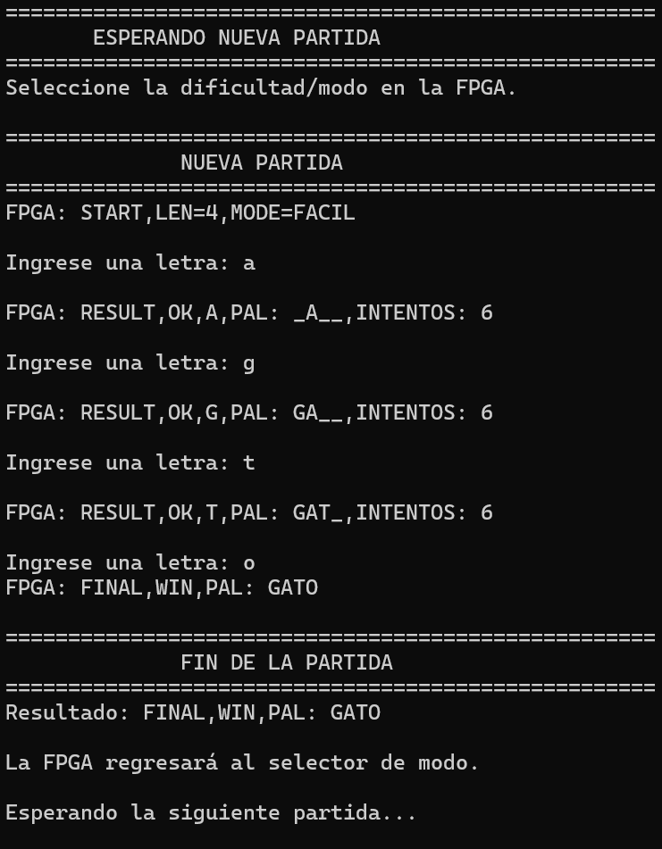
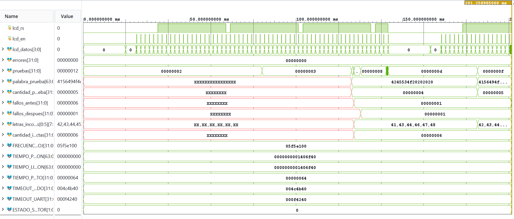

# Proyecto 2: Ahorcado-juego-electrónico

**Integrantes**

**Steven Sancho Orozco**  
*Escuela de Ingeniería Electrónica*
*Tecnológico de Costa Rica*  
Carné: 2019015506

**Joan Franco Sandoval**
*Escuela de Ingeniería Electrónica*
*Tecnológico de Costa Rica*
Carné: 2020248356

**Brayan Díaz Ruiz**
*Escuela de Ingeniería Electrónica*
*Tecnológico de Costa Rica*
Carné: 2018203585

**Dennis Manuel Arce Alvarez**
*Escuela de Ingeniería Electrónica*
*Tecnológico de Costa Rica*
Carné: 2018151568

*Fecha : 17/09/2026
---


## Introducción
El juego de "Ahorcado" se basa en adivinar una palabra por medio de letra a la vez, si el jugador se equivoca se le cuenta un fallo, usualmente, representado por un dibujo de un muñeco de palo ahorcado, el jugador pierde si el dibujo se completa y gana cuando logra adivinar la palabra. Para este proyecto, se adaptó el juego con el uso de una FPGA que controla una pantalla LCD donde se muestra el estado del juego y una aplicación de PC que se encarga de recibir las entradas del jugador. El juego también cuenta con un buzzer que busca brindarle inmersión a las rondas, además, de 2 niveles de dificultad que se basan en el tiempo para adivinar la palabra y la cantidad de letras que esta contiene. El jugador siempre puede observar el tiempo restante de la partida por medio de displays 7 segmentos, y el número de intentos que tiene en la aplicación y el LCD.


--- 


## Fundamentación teórica

El funcionamiento general de los módulos LCD se basa en la arquitectura interna del controlador HD44780, el cual integra un generador de caracteres para fuentes predefinidas o personalizadas, una memoria de datos de despliegue donde se almacena lo que se muestra en pantalla y un par de registros esenciales: el registro de instrucción y el registro de datos. La selección entre ambos registros se lleva a cabo mediante la señal de control RS, la cual forma parte de una interfaz física de comunicación junto a las señales de lectura/escritura (R/W), habilitación (E) y las líneas de datos configurables entre cuatro y ocho bits. Para asegurar su operabilidad correcta, el módulo requiere ejecutar de forma estricta una secuencia de inicialización que abarca el ajuste de funciones, el encendido del despliegue, el modo de entrada y el limpiado de pantalla, todo esto mientras se monitorea o respeta la señal de ocupado para verificar cuándo el dispositivo está capacitado para recibir nuevos comandos.  
En esta misma línea de soluciones de visualización, el PmodCLP de Digilent consiste en un módulo que incorpora una pantalla LCD alfanumérica regida por el mencionado controlador HD44780, lo que le permite presentar caracteres e información procesada a partir de las instrucciones dictadas por un dispositivo digital como una FPGA. Su integración física suele operar mediante un modo paralelo de cuatro bits que administra el intercambio de datos y comandos mediante las líneas de control RS y E. En el ámbito de una aplicación práctica como el juego del ahorcado, este periférico actúa como el medio directo de interacción visual con el usuario, desplegando elementos críticos del estado de la partida como la palabra oculta, las letras adivinadas y el progreso general. Para que dicha transmisión visual sea efectiva, resulta indispensable ejecutar correctamente la rutina inicial de configuración y apegarse con precisión a los tiempos de escritura estipulados por la tecnología del controlador.  
Por otra parte, la recepción e ingreso de las jugadas desde el exterior se realiza mediante el protocolo de comunicación serial asíncrona conocido como UART, el cual transmite y recibe información entre sistemas sin recurrir a una señal de reloj compartida. Cada trama de información dentro de este esquema se delimita por un bit de inicio, los bits de datos propiamente dichos, un bit de paridad opcional y uno o más bits de parada, siendo el formato 8N1 una de sus configuraciones más extendidas al carecer de paridad e incluir ocho bits de datos con un bit de parada. En plataformas reconfigurables como las FPGAs, la tasa de baudios equivalente a la velocidad de transmisión se genera a partir del reloj del sistema mediante divisores de frecuencia o contadores, exigiendo que tanto el transmisor como el receptor alineen sus parámetros de transmisión, sintonicen la señal de entrada con el reloj interno, efectúen el muestreo cerca del punto medio de cada bit y validen la estructura de la trama para garantizar un flujo de entrada confiable hacia la lógica del juego.  
Al llevar a cabo el diseño de los periféricos que interconectan estos bloques en buses de 32 bits, se aplican buenas prácticas que inician con la definición clara de un mapa de registros provisto de una decodificación de direcciones adecuada. Este mapa separa explícitamente los registros dedicados a las tareas de control, estado y datos, demarcando los permisos de lectura y escritura asociados a cada bit. Del mismo modo, debido a que las operaciones sobre periféricos como la pantalla no ocurren de manera instantánea, se integra un mecanismo de sincronización mediante señales de estado de inicio, ocupado y finalización que estructuran un protocolo de saludo entre el host procesador en la FPGA y los controladores externos.  
A nivel de almacenamiento de información constante dentro de la FPGA, se recurre al uso de memorias de solo lectura para alojar tablas de palabras o mensajes fijos mediante descripciones sintácticas en SystemVerilog como estructuras de selección o arreglos inicializados. La organización del texto de longitud variable dentro de estas memorias admite alternativas arquitectónicas: se puede reservar un espacio uniforme rellenado con ceros y complementado con la longitud real o un delimitador final para facilitar el cálculo de las direcciones, o bien es posible empacar los caracteres de forma continua y gestionar una tabla paralela con los punteros de inicio y extensión de cada cadena para optimizar los recursos de memoria consumidos en la síntesis del circuito.  
Finalmente, la selección aleatoria de los elementos almacenados en la memoria ROM se apoya en generadores pseudoaleatorios implementados como registros de desplazamiento con realimentación lineal. Estos circuitos generan secuencias periódicas a partir de una semilla inicial distinta de cero mediante operaciones lógicas de suma exclusiva en posiciones específicas de sus bits. Para convertir el valor del registro en un índice de consulta válido para la memoria, la salida pseudoaleatoria se adecua al rango disponible de entradas mediante operaciones aritméticas de módulo o técnicas de rechazo, garantizando una selección equilibrada de los datos constantes y completando el flujo funcional de la arquitectura del sistema.


---

## Presentación de resultados

### Módulo Validador_Letra
Este módulo tiene varias funciones, primero, cuando se activa la señal "procesar_letra", el módulo verifica primero que "letra_recibida" se encuentre dentro del rango válido de 0 a 25 que representan las letras mayúsculas entre la "A" y la "Z". Utiliza un registro interno de 26 bits llamado "letras_usadas" para recordar qué letras ya se han usado en la partida actual. Si la letra ingresada ya tiene su bit activado en este registro, el módulo levanta la bandera de salida "letra_repetida" y omite cualquier penalización.
El módulo también compara la letra ingresa simultáneamente con las 8 posibles posiciones de la palabra secreta. Si existe una coincidencia, se actualiza la señal "palabra_estado" sustituyendo los guiones bajos por la letra correspondiente y se emite un pulso en la salida "letra_correcta". En caso contrario, se incrementa el registro de fallos hasta un máximo de 6 intentos y se emite un pulso en la señal "letra_incorrecta".
Por último, el módulo evalúa, de manera combinacional, si el registro "palabra_estado" ya contiene todas las letras. Si todas las posiciones en "cantidad_letras" son caracteres válidos entre la 'A' y la 'Z', activa la señal de salida "palabra_completa" para indicarle a la FSM principal que se ha adivinado la palabra con éxito.

### Módulo UART y Controlador_UART
Módulo UART

El módulo UART implementa la comunicación serial entre la FPGA y un dispositivo externo, utilizando una frecuencia de reloj configurable y un baud rate de 115200 baudios por defecto. Su funcionamiento se divide en dos procesos principales: transmisión y recepción. Además, incorpora una interfaz de registros que permite que otros módulos del sistema accedan a los datos transmitidos, consulten los datos recibidos y controlen las operaciones de comunicación. Para ello, utiliza señales como write_enable, addr, wdata y rdata, que permiten realizar operaciones de escritura y lectura desde el controlador del juego. La comunicación física se realiza mediante rx_fisico y tx_fisico, mientras que la señal rst permite inicializar los registros y los procesos internos del módulo.

Transmisión de datos

El proceso de transmisión comienza cuando el controlador escribe el carácter que desea enviar en el registro registro_tx, mediante una operación de escritura en la dirección 00. Posteriormente, para iniciar la transmisión, escribe un valor que activa el bit 0 del registro de control, ubicado en la dirección 10. Esta operación genera la señal tx_pendiente, siempre que el transmisor no se encuentre activo ni tenga otra transmisión pendiente. Cuando el módulo detecta que existe una transmisión pendiente y el transmisor está disponible, construye la trama serial en el registro registro_tx_serial, utilizando un bit de inicio en nivel bajo, los ocho bits del carácter y un bit de parada en nivel alto. De esta manera, se prepara una trama de 10 bits correspondiente al formato 8N1.
Una vez preparada la trama, el transmisor activa la señal tx_activo e inicia el contador contador_tx, que determina cuánto tiempo debe permanecer cada bit en la salida serial. El registro bit_tx permite seleccionar progresivamente los bits de la trama, mientras que el contador determina cuándo debe avanzarse al siguiente. Para una frecuencia de reloj de 100 MHz y un baud rate de 115200, el módulo utiliza aproximadamente 868 ciclos de reloj por bit. Cuando el contador alcanza el valor establecido, se reinicia y se incrementa el índice del bit transmitido. Este proceso continúa hasta completar los 10 bits de la trama; entonces, tx_activo se desactiva y la línea tx_fisico vuelve al nivel lógico alto, indicando que el transmisor está en reposo y disponible para una nueva operación.

Recepción de datos

El proceso de recepción comienza con la detección del bit de inicio en la entrada rx_fisico. Debido a que esta señal proviene de un dispositivo externo y no está sincronizada con el reloj de la FPGA, el módulo utiliza dos registros, rx_sync1 y rx_sync2, para sincronizarla antes de procesarla. Cuando se detecta un nivel bajo en la señal sincronizada y el receptor no está activo, se inicia la recepción y se reinician el contador contador_rx y el índice bit_rx. Primero se espera medio período de bit para comprobar que la señal continúe en nivel bajo, validando así el inicio de la trama y reduciendo la posibilidad de interpretar una perturbación breve como una transmisión válida.
Después de validar el bit de inicio, el receptor espera intervalos completos de bit y almacena los ocho bits recibidos en registro_rx_serial, desde el menos significativo hasta el más significativo. Una vez recuperados los datos, se espera el bit de parada y se comprueba que la señal se encuentre en nivel alto. Si esta condición se cumple, el contenido del registro serial se copia a registro_rx y se activa la bandera rx_recibido, indicando que existe un nuevo dato disponible. Si el bit de parada no es válido, el módulo desactiva la recepción sin actualizar el registro de datos ni indicar una recepción correcta. De esta forma, se realiza una validación básica de la trama antes de entregar el carácter al resto del sistema.

Interfaz de registros y control de comunicación

El módulo UART dispone de tres direcciones principales de acceso. La dirección 00 permite escribir o consultar el registro de transmisión; la dirección 01 permite leer el último dato recibido; y la dirección 10 corresponde al registro de estado y control. En este último, el bit 0 indica si el transmisor está activo o tiene una transmisión pendiente, el bit 1 indica que se ha recibido un dato y el bit 2 refleja el estado de la salida física de transmisión. Asimismo, una escritura con el bit 1 activado en el registro de control permite limpiar la bandera rx_recibido, preparando al módulo para indicar una recepción posterior. Esta organización permite que el Controlador_UART gestione las operaciones sin intervenir directamente en los contadores y registros internos de transmisión y recepción.

Controlador UART

El módulo Controlador_UART se encarga de coordinar la comunicación entre el juego de ahorcado y el periférico UART, administrando tanto la recepción de letras como el envío de información relacionada con la partida. Su funcionamiento se basa en una máquina de estados finitos que controla las operaciones de lectura y escritura mediante las señales write_enable, addr, wdata y rdata. Además, recibe información de otros módulos, como la dificultad seleccionada, la cantidad de letras, la palabra actual, los fallos acumulados y el resultado de la validación de cada letra. Con estos datos, el controlador organiza los eventos del juego y prepara los mensajes que posteriormente serán transmitidos al dispositivo externo.

Recepción de letras

El proceso de recepción se realiza mediante los estados LEER_RX, CAPTURAR_RX y LIMPIAR_RX. Cuando la máquina de estados se encuentra en ESPERA, verifica que la partida esté activa y que no exista una letra pendiente de procesamiento. Si se cumplen estas condiciones, pasa a LEER_RX, donde consulta el registro de estado del periférico UART mediante la dirección 10. Si el bit 1 de rdata está activado, significa que existe un dato recibido y el controlador avanza a CAPTURAR_RX. En este estado, lee el registro de datos de recepción mediante la dirección 01, almacena el carácter en letra_guardada y activa la señal letra_disponible, que permite informar al resto del sistema que existe una nueva letra para procesar. Finalmente, pasa a LIMPIAR_RX, donde activa write_enable y escribe el valor 32'h00000002 en el registro de control para limpiar la bandera de recepción del UART. La letra permanece almacenada hasta que el módulo correspondiente activa consumir_letra, indicando que ya fue procesada.

Almacenamiento y gestión de eventos

El controlador incorpora registros de eventos pendientes que permiten conservar la información necesaria para preparar los mensajes de comunicación. Entre ellos se encuentran pendiente_inicio, pendiente_resultado, pendiente_final y pendiente_reset. Cuando se activa enviar_inicio, se guarda la dificultad y la cantidad de letras de la partida; cuando se activa enviar_resultado, se almacenan la letra ingresada, la palabra en su estado actual, los fallos acumulados y las señales que indican si la letra fue correcta, incorrecta o repetida. Por su parte, cuando se activa enviar_final, se guarda la palabra completa y el resultado de la partida, además de cancelar los eventos pendientes de inicio y resultado. Esta información permite preparar los mensajes utilizando los datos registrados durante cada evento, evitando depender exclusivamente de las señales que pueden cambiar posteriormente.

Preparación de los mensajes

La preparación de los mensajes se realiza mediante los estados PREPARAR_RESET, PREPARAR_INICIO, PREPARAR_RESULTADO y PREPARAR_FINAL. En cada uno se selecciona el tipo de mensaje, se reinicia el índice de transmisión y se establece la longitud correspondiente. Para ello, el controlador utiliza la señal mensaje_actual, que identifica el contenido que se desea transmitir, y base_memoria, que indica la posición inicial de los caracteres almacenados. En el caso del inicio de partida, se selecciona un mensaje diferente según la dificultad; para los resultados de letras, se distingue entre caracteres repetidos, correctos e incorrectos; y al finalizar se determina si corresponde enviar el mensaje de victoria o derrota. También se contempla un mensaje de reinicio que se prepara automáticamente después de liberar la señal rst.
Acceso a memoria y selección de caracteres
Una vez definido el mensaje, el controlador determina qué carácter debe transmitirse mediante la combinación de base_memoria e indice_mensaje. La señal direccion_memoria proporciona la dirección calculada para acceder a la memoria, mientras que dato_memoria contiene el carácter almacenado en esa posición. El módulo utiliza además la señal interna caracter_actual para seleccionar entre los datos obtenidos de memoria y los caracteres generados directamente mediante lógica combinacional. Por ejemplo, la función ascii_numero convierte valores numéricos a su representación ASCII, mientras que obtener_byte_palabra permite extraer un carácter específico de una palabra almacenada en un registro de 64 bits. Asimismo, la función vidas_restantes calcula las vidas disponibles a partir de los fallos acumulados y las convierte a formato ASCII. De esta manera, el controlador puede construir mensajes que contienen información variable, como la palabra actual, la letra ingresada y las vidas restantes.

Transmisión y control del periférico UART

La transmisión se realiza mediante los estados ENVIAR_DATO, INICIAR_TX y ESPERAR_TX. En ENVIAR_DATO, el controlador activa write_enable, selecciona la dirección 00 y escribe el carácter actual en el registro de transmisión del periférico UART. A continuación, en INICIAR_TX, escribe el valor 32'h00000001 en la dirección 10, activando la solicitud de envío. Posteriormente, pasa a ESPERAR_TX, donde consulta el bit 0 de rdata para determinar si el transmisor continúa ocupado o tiene una transmisión pendiente. Cuando dicho bit se encuentra en cero, el controlador incrementa indice_mensaje y vuelve a ENVIAR_DATO para transmitir el siguiente carácter. Este proceso continúa hasta alcanzar la longitud establecida para el mensaje, momento en el que regresa al estado ESPERA y queda disponible para atender nuevos eventos o recibir otra letra.
En conjunto, el Controlador_UART permite integrar la comunicación serial con los diferentes módulos del juego, transformando los eventos de la partida en mensajes organizados y gestionando la recepción de los caracteres ingresados por el usuario. Su máquina de estados coordina el acceso a los registros del periférico, la lectura de memoria y el envío secuencial de cada carácter, permitiendo comunicar información sobre el inicio, el desarrollo y la finalización de la partida.


### Módulo Debouncer
El módulo Debouncer se encarga de eliminar las fluctuaciones eléctricas que se producen al presionar o liberar los botones físicos de la FPGA. Debido a que un botón mecánico puede generar varios cambios rápidos de nivel lógico durante una sola pulsación, el módulo utiliza un contador para comprobar que la señal se mantenga estable durante un intervalo determinado. En este diseño, el tiempo de rebote se establece mediante el parámetro TIEMPO_REBOTE_MS, configurado por defecto en 20 ms, mientras que FRECUENCIA_RELOJ permite calcular la cantidad de ciclos necesarios según la frecuencia del reloj del sistema.
El funcionamiento se realiza de manera independiente para cada uno de los dos botones. Cuando la señal de entrada cambia respecto a la muestra anterior, el contador correspondiente se reinicia; si permanece sin cambios, el contador aumenta hasta alcanzar el tiempo establecido. Una vez cumplido este intervalo, el valor se actualiza en botones_estables, y finalmente se entrega mediante la salida estado_botones. Además, el módulo cuenta con un reinicio asíncrono que establece las señales y los contadores en cero. De esta manera, se obtiene una señal más confiable para que los demás módulos interpreten las pulsaciones sin reaccionar a cambios eléctricos momentáneos.


### Módulo LSFR
El módulo LFSR (Linear Feedback Shift Register o registro de desplazamiento con retroalimentación lineal) genera una secuencia pseudoaleatoria que se utiliza para seleccionar las palabras del juego. Está compuesto por un registro de 5 bits, cuya salida numero_aleatorio se actualiza en cada flanco positivo del reloj. Para obtener el nuevo valor, se desplazan los bits del registro y se calcula un bit de retroalimentación mediante la operación XOR entre las posiciones 4 y 2 del estado actual. Este resultado se introduce en el bit menos significativo, formando así el siguiente estado de la secuencia.
Al activarse la señal de reinicio, el registro se inicializa con el valor 5'b00001, evitando comenzar desde el estado de cero, que podría mantener el registro bloqueado en esa condición. Una vez iniciado, el LFSR continúa generando valores de manera secuencial y determinista, por lo que produce una secuencia pseudoaleatoria, pero no una aleatoriedad verdadera. En el proyecto, estos valores se utilizan como índices para acceder a las palabras almacenadas en la memoria, permitiendo variar la selección entre partidas sin implementar un generador aleatorio de mayor complejidad.


### Módulo de Memoria
El módulo Memoria almacena las palabras disponibles para el juego y los caracteres de los mensajes que se muestran en la pantalla LCD y se transmiten mediante UART. Para seleccionar una palabra, recibe las señales dificultad e indice_palabra, y utiliza una estructura case para asignar la palabra correspondiente a la salida palabra_actual. En el modo fácil se encuentran palabras como GATO, CASA y PERRO, mientras que en el modo difícil se incluyen términos como COMPUTO, CIRCUITO y HARDWARE. Cada palabra ocupa un espacio de 64 bits, equivalente a ocho caracteres ASCII, y las posiciones restantes se completan con espacios en blanco para mantener una longitud uniforme.
Adicionalmente, el módulo incorpora dos memorias combinacionales independientes para proporcionar los caracteres destinados a la pantalla LCD y a la comunicación UART. La salida dato_lcd entrega los caracteres según la dirección direccion_lcd, organizando los mensajes correspondientes a la selección de dificultad, el desarrollo de la partida y los resultados de victoria o derrota. Por su parte, dato_uart utiliza direccion_uart para acceder a los caracteres de mensajes como el inicio de partida, los resultados de las letras ingresadas y la finalización del juego. En ambos casos, las direcciones permiten que los controladores correspondientes obtengan los caracteres necesarios para construir y presentar los mensajes, mientras que las posiciones no definidas devuelven un espacio en blanco.


### Módulo Selector_dificultad
El módulo Selector_dificultad permite al usuario escoger el nivel de dificultad del juego y confirmar el inicio de una partida. Para ello, recibe las señales seleccionar y aceptar, que corresponden a las acciones de cambiar la dificultad e iniciar el juego, respectivamente. La variable dificultad almacena la selección actual mediante un bit: el valor cero representa el modo fácil y el valor uno representa el modo difícil. Al activarse el reinicio, la dificultad vuelve al modo fácil y la señal partida_iniciada se establece en cero.
Para evitar que una pulsación mantenida genere múltiples cambios o inicios consecutivos, el módulo conserva el estado anterior de cada botón mediante seleccionar_anterior y aceptar_anterior. De esta forma, detecta únicamente el flanco ascendente de cada señal, es decir, la transición de cero a uno. Cuando se detecta el flanco de seleccionar, se invierte el valor de la dificultad; cuando se detecta el flanco de aceptar, se activa partida_iniciada durante un ciclo de reloj. Esta señal permite que otros módulos, como el selector de palabras y el controlador del juego, reconozcan la confirmación del usuario y continúen con la preparación de la partida.


### Módulo Selector_palabra
El módulo Selector_palabra se encarga de seleccionar la palabra que se utilizará durante la partida, tomando en cuenta la dificultad elegida por el usuario. Para realizar esta función, incorpora una instancia del módulo LFSR, que genera una secuencia pseudoaleatoria de 5 bits, utilizada como índice para acceder a una palabra específica dentro del módulo Memoria. La señal dificultad determina cuál conjunto de palabras se consulta, mientras que palabra_memoria recibe la palabra seleccionada. De esta manera, se integra la generación del índice con el acceso a las palabras disponibles para cada nivel del juego.
Además, el módulo determina la cantidad de letras de la palabra seleccionada mediante una lógica combinacional que revisa cada uno de sus ocho espacios reservados. Cuando una posición contiene un carácter diferente al espacio en blanco (8'h20), se actualiza cantidad_letras_nueva para representar la longitud correspondiente. Finalmente, cuando se activa partida_iniciada, la palabra y su cantidad de letras se almacenan en los registros palabra_actual y cantidad_letras. Esto permite conservar la palabra seleccionada durante la partida, incluso si el índice generado por el LFSR continúa cambiando.


### Módulo de 7 segmentos
El módulo siete_segmentos muestra un número de tres cifras a partir de las entradas unidades, decenas y centenas, recibidas por separado. Utiliza multiplexado para activar un dígito a la vez y compartir las líneas de segmentos entre las tres posiciones.

El bloque secuencial always_ff incrementa contador_multiplex hasta 99 999. Cada 100 000 ciclos de reloj reinicia este contador y cambia digito_actual, alternando entre unidades, decenas y centenas. La entrada rst reinicia de forma asíncrona el contador y la selección del dígito.

El bloque combinacional always_comb habilita el ánodo correspondiente y convierte el valor seleccionado, de 0 a 9, en el patrón de segmentos. Ambas salidas son activas en bajo: un cero enciende el segmento o habilita el dígito correspondiente. Los cinco dígitos restantes permanecen apagados. Cuando mostrar_guiones está activo, se presentan tres guiones en lugar del número; en el modo numérico, los valores fuera del intervalo de 0 a 9 dejan en blanco la posición correspondiente.


### Módulo Temporizador
El módulo Temporizador controla el tiempo disponible durante una partida mediante una cuenta regresiva. Recibe las señales de actividad, dificultad y finalización del juego, y entrega el tiempo restante. También genera timeout para indicar que el tiempo se agotó.

El parámetro FRECUENCIA_RELOJ establece cuántos ciclos representan un segundo. Su valor predeterminado es 100 000 000, correspondiente a un reloj de 100 MHz. El registro contador_segundo, de 27 bits, cuenta esos ciclos, mientras que tiempo_restante, de 8 bits, almacena los segundos disponibles. Así, la reducción del tiempo ocurre una vez por segundo, aunque el circuito se actualiza en cada flanco de reloj.

Mientras partida_activa vale cero, el módulo mantiene el contador de ciclos y timeout en cero, y carga continuamente la duración correspondiente:

| `dificultad` | Tiempo inicial |
| --- | --- |
| 0 | 120 segundos |
| 1 | 90 segundos |

Al comenzar la partida se utiliza el tiempo previamente cargado. Cambiar dificultad durante una partida activa no modifica la cuenta. Cuando contador_segundo alcanza CICLOS_SEGUNDO - 1, se reinicia y se resta un segundo a tiempo_restante. Si quedaba un segundo, el tiempo pasa a cero y se activa timeout.

Si la partida sigue activa y aparece victoria o derrota, ambos registros conservan su valor y timeout se desactiva. Las asignaciones de cada registro a sí mismo expresan esa retención. Si partida_activa pasa a cero, se vuelve a cargar el tiempo inicial, porque esa condición tiene prioridad sobre victoria y derrota. Por su parte, rst reinicia ambos registros y timeout de forma asíncrona. Como el reinicio deja el tiempo en cero, debe existir un ciclo fuera de partida para cargar la duración antes de comenzar.

La señal timeout es un pulso de un ciclo de reloj, no un indicador permanente. Si el tiempo permanece en cero y la partida continúa activa sin victoria ni derrota, el código vuelve a generar ese pulso cada segundo.

Finalmente, el bloque always_comb obtiene centenas, decenas y unidades mediante divisiones enteras y operaciones de residuo. Cada salida contiene un dígito decimal en cuatro bits, adecuado para conectarse al módulo siete_segmentos, que se encarga de encender el display.


### Módulo LCD y Controlado_LCD

Los módulos LCD y controlador_LCD son los encargados de coordinar la comunicación del juego con respecto al periférico, donde como función general, el módulo del controlador, que funciona como máquina de estados interna del LCD, quien le comunica al módulo LCD cuando y cuál caracter escribir en la pantalla del LCD.
El controlador_LCD detecta un cambio relevante (cambio_pantalla), únicamente cuando el LCD está libre (rdata[0] == 0). Esto ocurre cuando cambia estado_actual, dificultad, victoria, derrota, fallos, o el contenido de palabra_estado/palabra_actual. En cada paso de escritura, lee el carácter correspondiente desde el módulo de Memoria (vía direccion_memoria / dato_memoria), revelando la letra como parte de la palabra(letra correcta) o como fallo.
El controlador también maneja el bus hacia el LCD, activando wenable=1, con addr fija, habilitando y dándole lugar al byte a escribir en wdata[7:0].
Ahora bien, el módulo LCD captura la escritura solo si está en estado "LISTO", solo si wenable = 1 mientras estado == LISTO, dando lugar a registrar rs_actual, saliendo del estdo "LISTO". En el mismo flanco rdata[0]=1, indicando el bit de "BUSY" como activo.
Se debe aclarar que para el módulo LCD por diseño, en su escritura, del bus que viene del módulo controlador del LCD, la señal lcd_datos[3:0] es la encargada de generar lo pasos a seguir para el periférico, con lcd_rs y lcd_en, ejecutandose con lcd_en en bajo.
Finalmente el módulo LCD vuelte a un estado "LISTO" y rdata[0] cae a 0, siguiendo a un estado de "ESPERAR", detectando el cambio y avanzandi al siguiente caracter, repitiendo el ciclo hasta conseguir adivinar la palabra, fallar 6 veces o time out.
En la siguiente imagen se evidencia las interconexiones existentes entre la FPGA que maneja los módulos involucrados con el periférico LCD.



### Módulo de LED de estado

Este es un módulo pequeño que tiene como función principal comunicar al jugador que su partida ha finalizado y que el juego se va a reiniciar por medio de una señal de reset.

### Módulo Buzzer

El módulo Buzzer recibe el bus principal de victoria o derrota que sale directamente de la FSM principal, con un tamaño de 2 bits, convirtiéndose en un código de eventos por ejemplo 00=silencio, 01=acierto, 10=error, 11=fin de partida. Para el proyecto se tiene la siguiente tabla de cómo se manejaron los tipos de sonido.

| Condición | Tipo y duración |
| --- | --- |
| IDLE | Silencio, no tiene duración |
| SONIDO_CORRECTO | pitido agudo al acertar una letra (dura 100 ms) |
| SONIDO_INCORRECTO | pitido grave al fallar (dura 150 ms) |
| SONIDO_VICTORIA1 y 2 | dos tonos seguidos cuando ganas, uno después del otro (250 ms cada uno) |
| SONIDO_DERROTA1 y 2 | otros dos tonos seguidos cuando pierde, uno después del otro (250 ms cada uno) |


### Módulo FSM

implementa el controlador central de la lógica de juego del sistema Ahorcado. Es responsable de coordinar la secuencia de eventos del juego (selección de dificultad, inicio de partida, procesamiento de letras, verificación de condiciones de fin de partida) y de generar las señales de control que activan al resto de los módulos del sistema (Validador_Letra, Controlador_UART, Temporizador, Buzzer, LED_estado, Controlador_LCD).
Se debe aclarar que el sistema maneja dos procesadores separados, el primero, un bloque always_ff síncrono, que actualiza el registro de estado (estado <= siguiente_estado) y los registros auxiliares (resultado_victoria, contador_final). El segundo bloque always_comb, que calcula la señal combinacional siguiente_estado en función del estado actual y las entradas.

Temporización del estado final

Al ingresar a FINALIZADO, el contador contador_final (32 bits) se incrementa en cada ciclo de reloj hasta alcanzar DURACION_FINAL = 200,000,000 ciclos. Con una frecuencia de reloj de 100 MHz, este valor corresponde a un intervalo de 2 segundos, durante el cual se mantiene visible el resultado antes de retornar automáticamente a SELECTOR.

La señal estado_actual codifica los seis estados internos en solo 2 bits, agrupando INICIALIZAR, ESPERAR_LETRA, PROCESAR_LETRA y COMPROBAR_RESULTADO bajo el valor 01 ("jugando"), de forma que los módulos consumidores (LED_estado, Controlador_LCD) no requieren conocer el detalle interno de la máquina de estados.


### Script ahorcado.py

El módulo corresponde a la aplicación de interfaz de usuario en la computadora (host) que complementa el sistema digital implementado en la FPGA
Su función general es recibir por el puerto serial los mensajes de estado que envía la FPGA y los traduce a una presentación legible en consola, además de capturar las letras que el usuario escribe en el teclado de la computadora y transmitirlas de vuelta hacia la FPGA


### Módulo TOP

El módulo TOP_AHORCADO constituye el nivel jerárquico superior de todo el diseño digital del sistema de juego Ahorcado. A diferencia de los módulos descritos anteriormente, que implementan una función específica del sistema (generación de palabras, validación de letras, temporización, comunicación serial, control de pantalla, etc.), este módulo no contiene prácticamente ninguna lógica de comportamiento propia. Su función es estrictamente estructural: instanciar cada uno de los subcircuitos que conforman el sistema y establecer, mediante la interconexión de sus puertos, las rutas por las cuales fluye la información entre ellos. Es, en el sentido más literal, la descripción del cableado completo del sistema, y por esa razón constituye el punto de partida obligado para comprender cómo se relacionan entre sí todos los módulos que fueron documentados de manera individual en las secciones anteriores.

Los puertos de entrada y salida de TOP_AHORCADO corresponden directamente a las señales físicas disponibles en los pines de la FPGA: el reloj del sistema y la señal de reinicio, los dos botones físicos utilizados para seleccionar la dificultad y confirmar el inicio de la partida, las líneas de recepción y transmisión del puerto serial hacia la computadora, los segmentos y ánodos del display de siete segmentos empleado para mostrar el tiempo restante, el pin del zumbador encargado de los efectos sonoros, los tres LEDs indicadores del estado general del juego, y finalmente el conjunto de señales de control y datos que se conectan físicamente a la pantalla de cristal líquido (la señal de selección de registro, la señal de habilitación y los cuatro bits de datos en modo de cuatro bits). Ninguna de estas señales físicas se procesa directamente dentro de TOP_AHORCADO: todas se reenvían de inmediato hacia el subcircuito correspondiente, que es el que efectivamente interpreta o genera dicha señal.


## Análisis de resultados
Se realizó un testbench general para el módulo TOP donde se prueban las funciones en conjunto de los distintos módulos que lo componen. Esta primera imagen representa cuando el sistema recibe la señal de reset, donde no importa el estado de la partida, esta se reinicia al momento en que solicita al usuario elegir la dificultad de la partida, y el jugador puede comenzar una nueva ronda.



Para la segunda prueba, se simuló una partida perdida, donde el jugador fue incapaz de acertar la palabra. Los intentos se restan cada vez que se ingresa una letra incorrecta, excepto los momentos donde se ingresa una letra repetida, en la simulación se utilizó la letra "g" como ejemplo. Al acabar la partida, se devuelve un mensaje especificando que se perdió y también devuelve la palabra completa, además de retornar a la selección de dificultad.



Cuando la partida sufre de un "Timeout", se aplica la misma lógica que cuando se sufre una derrota por usar todos los intentos, se acaba la partida, devuelve el mensaje de derrota y la palabra, y regresa a la selección de dificultad.



Para el caso de victoria, el final de la partida es similar al de la derrota, excepto que el mensaje especifica que se ganó la ronda.



En la ventana del waveform se observa un ejemplo de como actúan y manejas las señales correspondientes una letra ingresada incorrecta.



Lo siguiente es el resultado que se escribe en la terminal al finalizar las pruebas del testbench. 
```Testbench
# run 1000ns

----------------------------------------------------
PRUEBA 1: ESTADO INICIAL
----------------------------------------------------
[OK]           FSM inicia en SELECTOR
[OK]       Dificultad inicial = FACIL
[OK]             Victoria inicial = 0
[OK]              Derrota inicial = 0
[OK]             Fallos iniciales = 0

----------------------------------------------------
PRUEBA 2: CAMBIO DE DIFICULTAD
----------------------------------------------------
INFO: [USF-XSim-96] XSim completed. Design snapshot 'TB_TOP_AHORCADO_behav' loaded.
INFO: [USF-XSim-97] XSim simulation ran for 1000ns
launch_simulation: Time (s): cpu = 00:00:15 ; elapsed = 00:00:15 . Memory (MB): peak = 1932.680 ; gain = 0.000
run 10 s
[OK]      Dificultad cambia a DIFICIL
[OK]        Dificultad vuelve a FACIL

----------------------------------------------------
PRUEBA 3: INICIAR PARTIDA
----------------------------------------------------
[OK]          Partida llega a JUGANDO
[OK]      partida_iniciada vuelve a 0
[OK]            FSM permanece JUGANDO
[OK]     No existe victoria inmediata
[OK]      No existe derrota inmediata

----------------------------------------------------
PRUEBA 4: PALABRA SELECCIONADA
----------------------------------------------------
[INFO] Palabra seleccionada = BESO    
[INFO] Cantidad de letras = 4
[OK]        Cantidad de letras valida
[OK]  Palabra estado fue inicializada
[OK]  Primera letra inicia como guion
[OK]  Segunda letra inicia como guion
[OK]  Tercera letra inicia como guion
[OK]   Cuarta letra inicia como guion

----------------------------------------------------
PRUEBA 5: LCD
----------------------------------------------------
[OK]       LCD termino inicializacion

----------------------------------------------------
PRUEBA 6: LETRA INCORRECTA
----------------------------------------------------
[INFO] Letra incorrecta 1: A
[INFO] Letra incorrecta 2: C
[INFO] Letra incorrecta 3: D
[INFO] Letra incorrecta 4: F
[INFO] Letra incorrecta 5: G
[INFO] Letra incorrecta 6: H
[OK] ontraron seis letras incorrectas
[INFO] Enviando letra: A
[OK] RX limpiado correctamente
[OK] ra incorrecta aumenta fallos a 1
[OK]            FSM permanece JUGANDO
[OK]           Derrota permanece en 0

----------------------------------------------------
PRUEBA 7: LETRA REPETIDA
----------------------------------------------------
[INFO] Enviando letra: A
[OK] RX limpiado correctamente
[OK] Letra repetida no aumenta fallos

----------------------------------------------------
PRUEBA 8: LETRAS CORRECTAS
----------------------------------------------------
[INFO] Letra correcta: B
[INFO] Enviando letra: B
[OK] RX limpiado correctamente
[INFO] Letra correcta: E
[INFO] Enviando letra: E
[OK] RX limpiado correctamente
[INFO] Letra correcta: S
[INFO] Enviando letra: S
[OK] RX limpiado correctamente
[INFO] Letra correcta: O
[INFO] Enviando letra: O
[OK] RX limpiado correctamente

----------------------------------------------------
PRUEBA 9: VICTORIA
----------------------------------------------------
[OK]            FSM pasa a FINALIZADO
[OK]                     Victoria = 1
[OK]                      Derrota = 0
[OK]              mostrar_guiones = 1
[OK] e palabra revelada correctamente
[OK] e palabra revelada correctamente
[OK] e palabra revelada correctamente
[OK] e palabra revelada correctamente

----------------------------------------------------
PRUEBA 10: LCD DESPUES DE VICTORIA
----------------------------------------------------
[OK] LCD termino pantalla de victoria

----------------------------------------------------
PRUEBA 11: ESTADO FINAL
----------------------------------------------------
[OK]          Victoria permanece en 1
[OK]           Derrota permanece en 0
[OK]      FSM permanece en FINALIZADO

----------------------------------------------------
PRUEBA 12: SALIDAS
----------------------------------------------------
[OK]    Segmentos tienen valor valido
[OK]       Anodos tienen valor valido
[OK]         LEDs tienen valor valido
[OK]        Buzzer tiene valor valido

====================================================
INICIANDO SEGUNDA PARTIDA
====================================================

----------------------------------------------------
PRUEBA 13: NUEVA PARTIDA
----------------------------------------------------
[OK]    Reset devuelve FSM a SELECTOR
[OK]              Victoria vuelve a 0
[OK]               Derrota vuelve a 0
[OK]          Fallos se reinician a 0
[OK]        Dificultad vuelve a FACIL
[OK]          Partida llega a JUGANDO
[OK]              Victoria vuelve a 0
[OK]               Derrota vuelve a 0
[OK]          Fallos se reinician a 0

----------------------------------------------------
PRUEBA 14: SEGUNDA PARTIDA
----------------------------------------------------
[INFO] Segunda palabra = AVION   
[INFO] Cantidad de letras = 5
[OK]        Cantidad de letras valida
[OK]      Primera letra inicia oculta
[OK] tida no tiene victoria inmediata
[OK] rtida no tiene derrota inmediata

----------------------------------------------------
PRUEBA 15: SEIS LETRAS INCORRECTAS
----------------------------------------------------
[INFO] Letra incorrecta 1: B
[INFO] Letra incorrecta 2: C
[INFO] Letra incorrecta 3: D
[INFO] Letra incorrecta 4: E
[INFO] Letra incorrecta 5: F
[INFO] Letra incorrecta 6: G
[OK] ontraron seis letras incorrectas
[INFO] Enviando letra: B
[OK] RX limpiado correctamente
[INFO] Enviando letra: C
[OK] RX limpiado correctamente
[INFO] Enviando letra: D
[OK] RX limpiado correctamente
[INFO] Enviando letra: E
[OK] RX limpiado correctamente
[INFO] Enviando letra: F
[OK] RX limpiado correctamente
[INFO] Enviando letra: G
[OK] RX limpiado correctamente
[OK]               Contador llega a 6
[OK]   Comparador detecta seis fallos
[OK]            FSM pasa a FINALIZADO

----------------------------------------------------
PRUEBA 16: DERROTA
----------------------------------------------------
[OK]         FSM permanece FINALIZADO
[OK]                      Derrota = 1
[OK]                     Victoria = 0

----------------------------------------------------
PRUEBA 17: UART DESPUES DE DERROTA
----------------------------------------------------
[OK]         FSM permanece FINALIZADO
[OK]           Derrota permanece en 1
[OK]          Victoria permanece en 0
[OK] os no cambian despues de derrota

----------------------------------------------------
PRUEBA 18: RESET FINAL
----------------------------------------------------
[OK]    Reset devuelve FSM a SELECTOR
[OK]            Reset limpia victoria
[OK]             Reset limpia derrota
[OK]              Reset limpia fallos
[OK] eset devuelve dificultad a FACIL
[OK]                  Reset limpia TX
[OK]                  Reset limpia RX
[OK]        Reset limpia TX pendiente
[OK]         Reset limpia RX recibido


====================================================
             FIN DE PRUEBAS AHORCADO
====================================================

Pruebas ejecutadas : 18
Errores encontrados: 0

****************************************************
*                                                  *
*          TODAS LAS PRUEBAS PASARON              *
*                                                  *
*                  18 / 18                       *
*                                                  *
****************************************************
```
---

### Conclusión

los aspectos técnicos abordados, la integración exitosa de periféricos en una FPGA depende en gran medida de la correcta sincronización entre los dominios de tiempo internos del sistema y los protocolos de comunicación externos. Ya sea gestionando las estrictas temporizaciones de escritura y secuencias de inicialización que exige el controlador HD44780 en la pantalla PmodCLP, o realizando un muestreo preciso en el punto medio de cada bit recibido mediante la interfaz serial UART, el diseño digital debe priorizar la estabilidad temporal para asegurar una transferencia de datos robusta y libre de errores.  
Asímismo, la estructuración de la arquitectura interna del sistema se beneficia sustancialmente del seguimiento de buenas prácticas en la organización del mapa de registros y la memoria. La separación explícita de señales de control, estado y datos sobre buses de 32 bits, sumada al establecimiento de protocolos de saludo (handshake) mediante banderas de ocupado y finalización, permite que el procesador interactúe de manera eficiente con periféricos lentos como la pantalla LCD sin bloquear las operaciones principales.  
Por otro lado, la gestión eficiente de la información constante en bloques de memoria ROM demuestra la importancia de equilibrar la complejidad del hardware con el consumo de recursos de la FPGA. Al emplear de técnicas de empaquetado para cadenas de caracteres de longitud variable, ya sea mediante delimitadores o tablas de punteros independientes— optimiza el uso de la lógica reconfigurable, mientras que la integración de registros LFSR proporciona una solución ligera y eficaz para generar índices pseudoaleatorios con distribución uniforme sin recargar el área del circuito.  
En conjunto, la combinación de módulos de visualización interactiva, recepción serial asíncrona, almacenamiento constante optimizado y generación de aleatoriedad conforma una plataforma integral y modular. Este enfoque estructurado no solo facilita el desarrollo de aplicaciones complejas como el juego del ahorcado, sino que establece una metodología reutilizable y escalable para el diseño de periféricos a medida en plataformas digitales modernas

---

### Referencias

1. David Harris y Sarah Harris. Digital Design and Computer Architecture. RISC-V
Edition. Morgan Kaufmann, 2022, p ´agina 564. ISBN: 978-0-12-820064-3
2. Pong P. Chu. FPGA Prototyping by SystemVerilog Examples. Wiley, 2018, p ´agi-
na 656. ISBN: 978-1-119-28266-2.
3. YosysHQ. Memory handling. Yosys Documentation, s. f. Consulta: 18 de septiembre de 2026.
4. OpenTitan. Primitive Component: LFSR. OpenTitan Documentation, s. f. Consulta: 18 de septiembre de 2026.
5. Daniel Lemire. Fast Random Integer Generation in an Interval. arXiv, 2018. Identificador: arXiv:1805.10941.
6. GeekforGeeks. Switch Debounce in Digital Circuits, 2026. Consulta: 18 de septiembre de 2026.
7. RY-ELE. Temporizadores y circuitos de temporización: Implementación de retardos con relés, 2025. Consulta: 18 de septiembre de 2026.